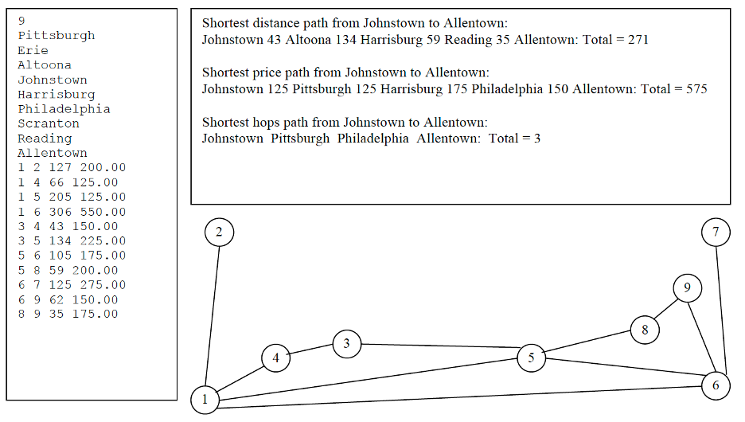

**This program is adapt from the assignment of cs1501 in University of Pittsburgh**

Represent the graph using **adjacency lists**. For example,  for the shortest distance paths, **Dijkstra’s algorithm** is used and to obtain the shortest-hops path **breadth-first search** is used.

. The test program `AirlineTest.java` has a menu-driven loop that asks the user for many choices. 

.	Below is an example input file, visual graph, and response to some of the queries listed above. The index numbers for the vertices are based on the order that the cities appear in the file (note that the indexing starts at 1).

